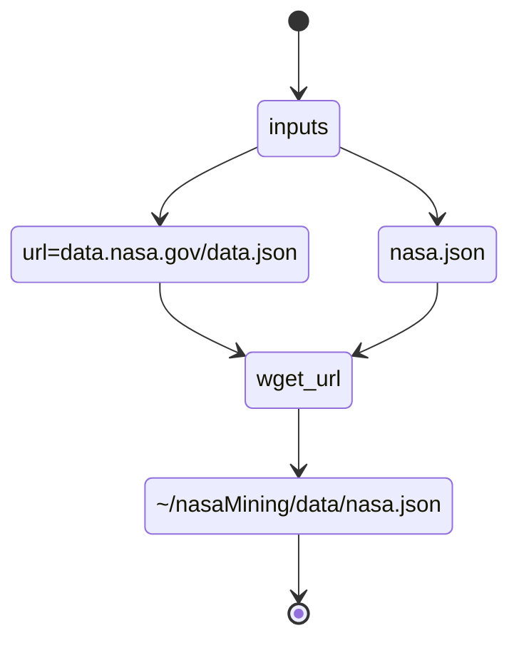

# Diagrams

## Data aquisition

## Keyword preprocessing

## Frontend

### Reference

- [mermiad-js](https://mermaid-js.github.io/mermaid/#/) specifications
- [mermaid.live](https://mermaid.live) online editor

